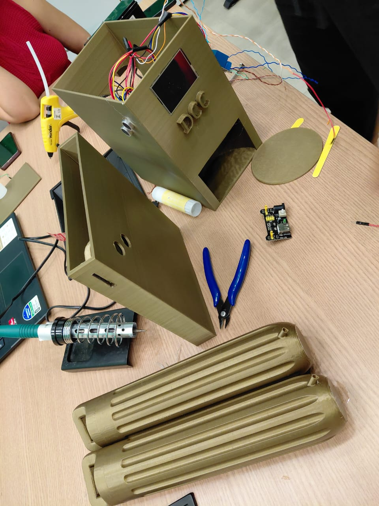

# Automated Coffee & Tea Machine (ESP32 + Nextion)

## 📚 About This Project

This project was developed at the **Federal University of Roraima (UFRR)**, in the **Maloca das iCoisas Laboratory**, as part of the course **COMP 923 - Embedded Systems**, under the guidance of [**Prof. Herbert Rocha**](https://github.com/hbgit).

---

This project is an embedded system for a hot beverage vending machine (coffee and tea). It uses an ESP32 for logic control, ultrasonic sensors for process detection, and a Nextion display for the Human-Machine Interface (HMI).

## 📂 Contents

The project directory structure is organized as follows:

* **`docs/`** - Project documentation, including requirements reports, circuit diagrams, and operation manuals.
* **`src/`** - Includes the Nextion interface project files (`.HMI`, `.tft`) and the source code (`.ino`) used on the ESP32.

## 🛠 Hardware

The physical project consists of the following components:

**Control & Interface**
* 1x ESP32 Devkit V1 Board
* 1x Nextion NX3224T024_011 Display (Touchscreen)

**Sensors & Actuators**
* 2x HC-SR04 Ultrasonic Sensors (Coin and Cup detection)
* 2x Peristaltic Pumps - Rohs Grothen G328
* 1x Relay Module SRD-05VDC-SL-C (Pump/Power control)

**Power & Structure**
* 1x Valve Regulated Lead-Acid (VRLA) Battery 12V
* 2x 3D Printed Cases (PLA) for main structure and coin mechanism
* 1x 3D Printed Plate (PLA)
* 2x 3D Printed Liquid Reservoirs (PLA)
* Hoses and Dispensing Nozzles

## Software Used

* **Arduino IDE:** For ESP32 firmware programming.
* **Nextion Editor (LTS):** For graphical interface development.
* **TinkerCad:** For 3D modeling and/or circuit simulation.
* **Doxygen:** For source code documentation.

## How it Works

The code operates based on a Finite State Machine (FSM), ensuring the process follows a safe logical order:

1.  **Start:** The system initializes and waits for a coin to be inserted.
2.  **Coin Insertion:** The HC-SR04 sensor (Pins X/Y) detects a coin drop.
3.  **Cup Placement:** The second HC-SR04 sensor (Pins X/Y) verifies a cup is in the dispenser.
4.  **Selection:** The user selects "Coffee" or "Tea" on the Nextion screen.
5.  **Preparation:** The corresponding pump is activated for a set duration , updating a progress bar on the screen.
6.  **Completion:** The system waits for the cup to be removed before resetting to the start state for a new cycle.

## 🔌 Pinout (ESP32)

| Component | ESP32 Pin | Function |
| :--- | :--- | :--- |
| **Coin Trig** | GPIO 32 | Coin Sensor Trigger |
| **Coin Echo** | GPIO 33 | Coin Sensor Echo |
| **Cup Trig** | GPIO 19 | Cup Sensor Trigger |
| **Cup Echo** | GPIO 18 | Cup Sensor Echo |
| **Coffee Relay** | GPIO 25 | Coffee Pump Activation |
| **Tea Relay** | GPIO 26 | Tea Pump Activation |
| **Nextion RX** | GPIO 16 | RX2 (Serial) |
| **Nextion TX** | GPIO 17 | TX2 (Serial) |

## Authors

- **Andersson Silva Pereira** — *andersonwya4@gmail.com*
- **Matheus Rebouças de Lima** — *mthsbusiness91@protonmail.com*
- **Paulo César Pereira Belmont** — *paulopereira737@hotmail.com*
- **Sarah Evelyn do Vale Silva** — *sarahevelyn.scholar@gmail.com*

## Additional Photos

More photos of the 3D-printed parts, internal circuits and assembly process are available in the [`docs/img/`](docs/img/) folder.