# 3D Modeling Documentation (Tinkercad)

## 1. Main Enclosure (3D Model Assembly)
This section documents the main enclosure design, modeled entirely in Tinkercad. This 3D structure is the chassis designed to house the system's components, including mounting points for the UI, dispensing area, fluid routing, and internal supports.

### Purpose
The main enclosure integrates:
- The user interface (touchscreen opening).
- The dispensing window (cup insertion area).
- Internal mounts for reservoirs, pumps, and tube routing.
- The ultrasonic sensor used for coin detection (installed inside the main enclosure, aligned to detect the coin passing through the chute path).

### Images
| Top View / Internal Layout | Alternate Image |
| :---: | :---: |
| 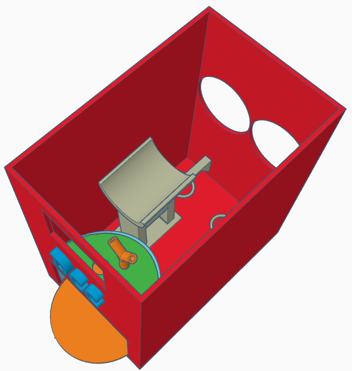 | 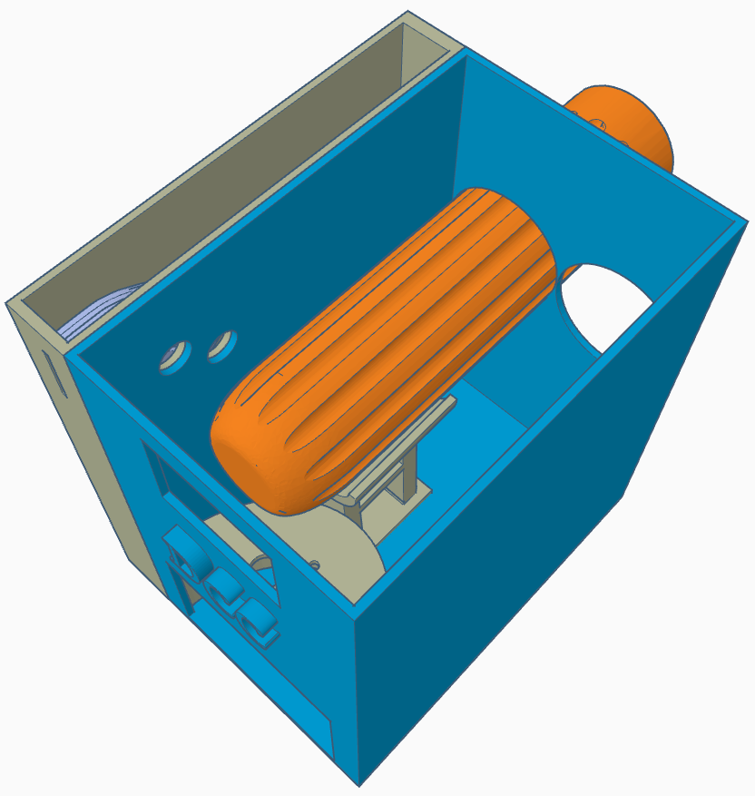 |

**Front View (UI & Dispensing Area):**

  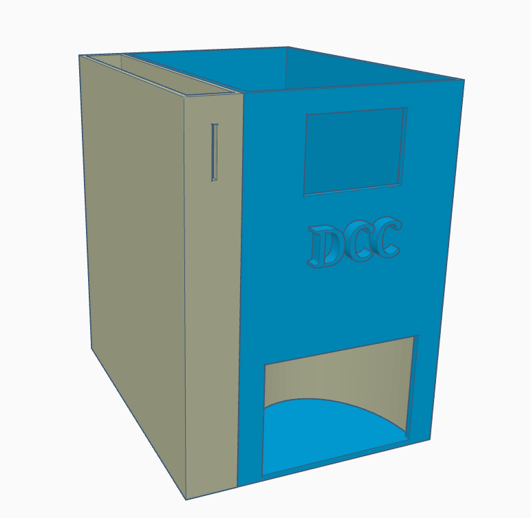

---

## 2. Coin Box Module (Side Module)
The coin box (side module) is the entry point for coins. It is physically attached to the main enclosure and is responsible for guiding the coin into the sensing region.

### Images
| External View | Internal View |
| :---: | :---: |
| 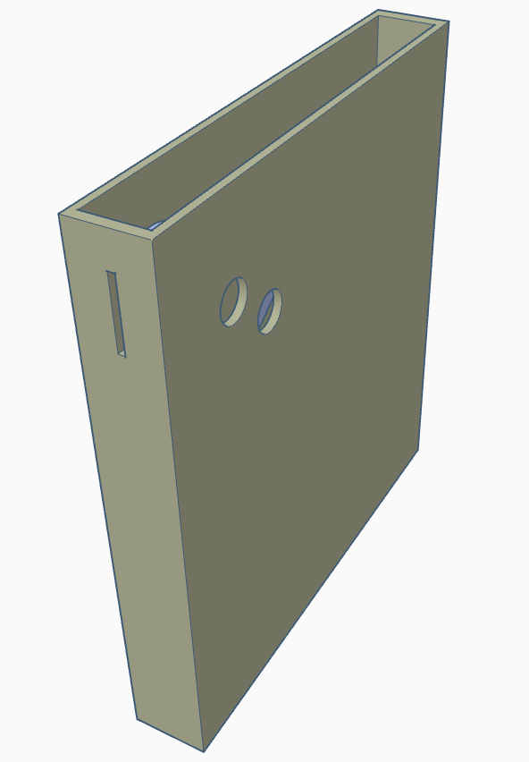 | 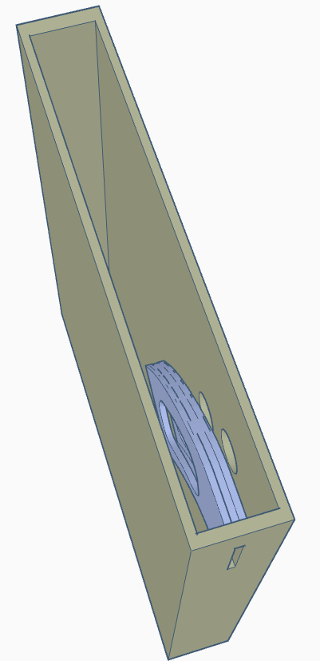 |

---

## 3. Coin Chute ("Toboggan") + Coin Detection
Inside the coin box, a gravity-fed chute (toboggan) guides the coin along a controlled path. The chute is designed so that, as the coin slides down, it passes through a region where an ultrasonic sensor inside the main enclosure can detect it.

### Sensor Positioning
- The ultrasonic sensor used for coin detection is installed inside the main enclosure and is oriented at approximately **45°**, aimed toward the coin path to produce a reliable distance change when a coin passes.

### Images
| Front View | Side View |
| :---: | :---: |
| 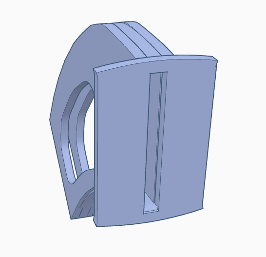 | 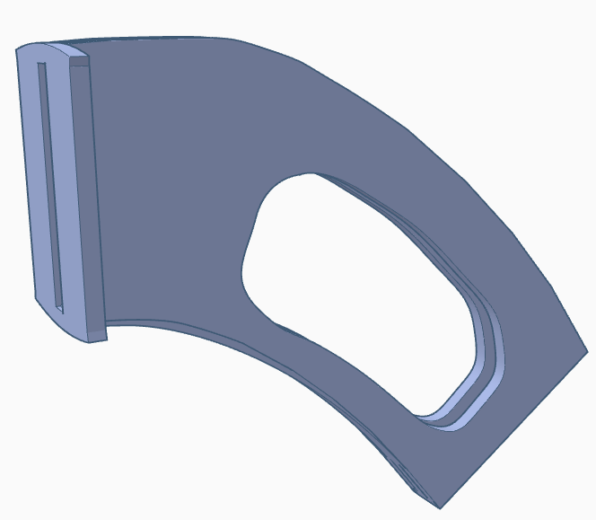 |

---

## 4. Cup Insertion Area + Cup Base + Cup Presence Sensor
This subsystem guarantees correct cup positioning before dispensing and adds safety/automation by verifying cup presence.

### Cup Insertion (Dispensing Window)
The front-bottom opening is where the user inserts the cup. The geometry is designed to guide the cup into a stable dispensing position.

### Cup Base (Support Plate)
A base/plate is included to support the cup and keep it aligned under the outlet (Y-connector output).

### Cup Presence Ultrasonic Sensor (Top Hole)
A second ultrasonic sensor is used to detect whether a cup is present. A dedicated hole/opening is placed **on the upper part** of the cup insertion area to mount this sensor, facing the cup region.

### Images
**Cup Station & Y-Connector Alignment:**

  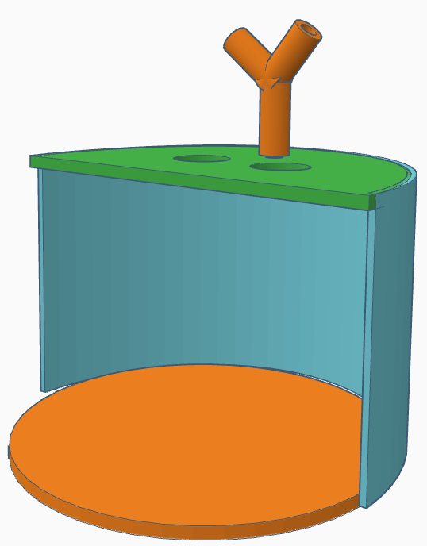

| Sensor Holes (Bottom View) | Rear View |
| :---: | :---: |
| 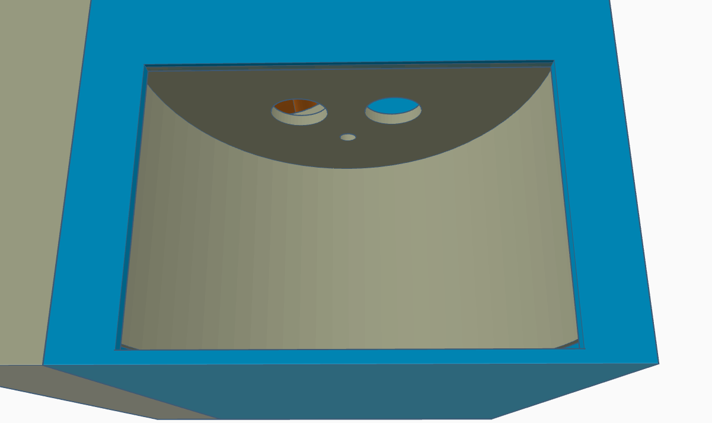 | 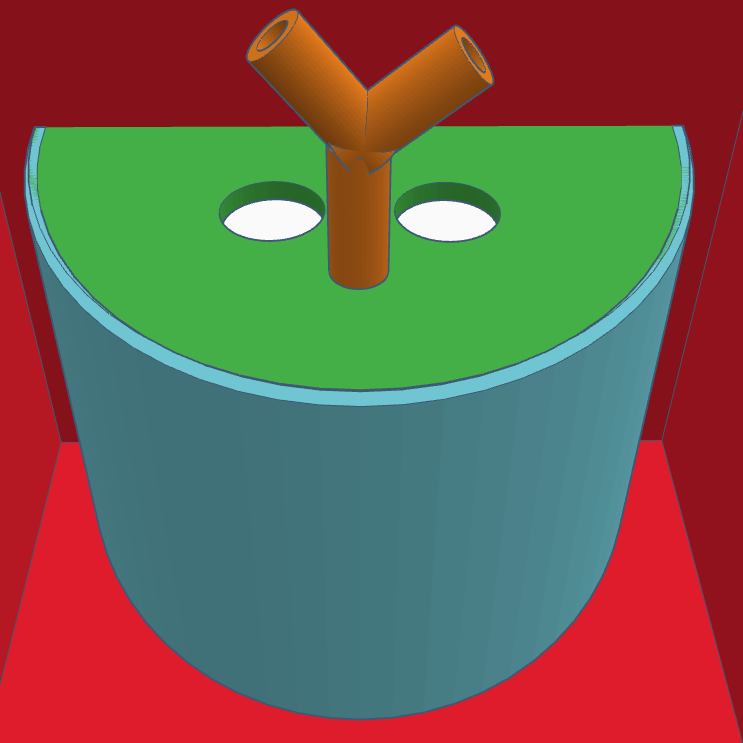 |

---

## 5. Y-Connector (Fluid Convergence and Alignment)
The Y-connector is a custom printed part that merges two fluid lines (tea and coffee) into a single outlet. It is positioned so the combined output falls precisely into the cup at the center of the cup station, minimizing splash and misalignment.

### Images
| Placement Overview | Internal Channel View |
| :---: | :---: |
| 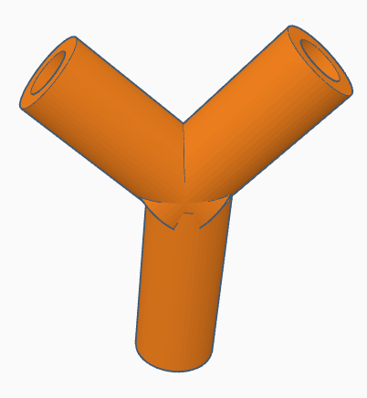 | 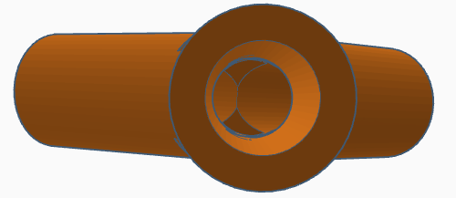 |

---

## 6. Reservoir Support (Tea & Coffee Holders)
An internal support structure stabilizes the tea and coffee reservoirs.

### Images
| Structure Overview | Side Profile |
| :---: | :---: |
| 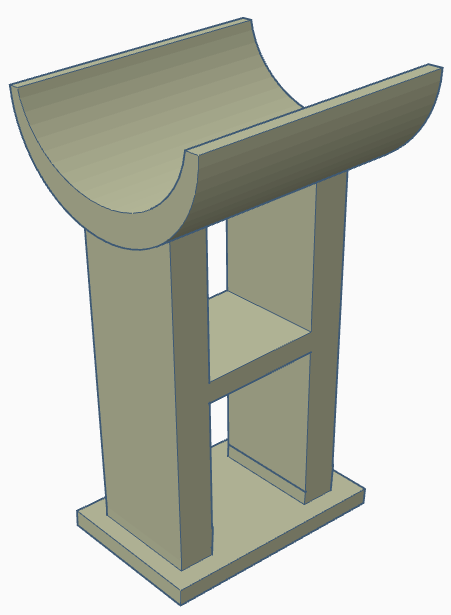 | 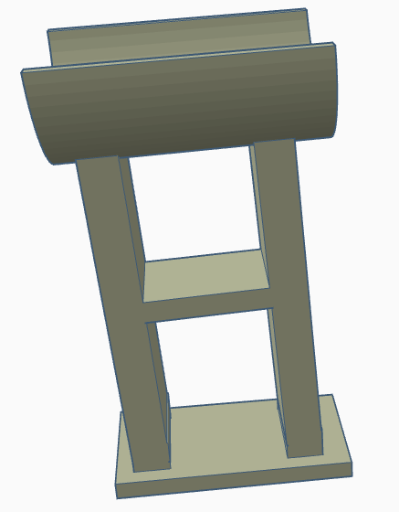 |

---

## 7. Pump Motor Mounts (Liquid Pump Supports)
Two smaller mounts are used to hold the pump motors responsible for pulling liquids from the reservoirs. These mounts constrain movement and reduce vibration, keeping tube routing stable and repeatable.

### Images
| Mount Isometric View | Mount Front View |
| :---: | :---: |
| 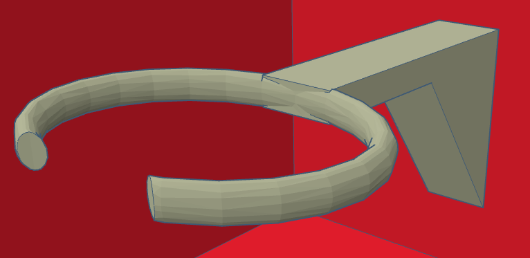 | 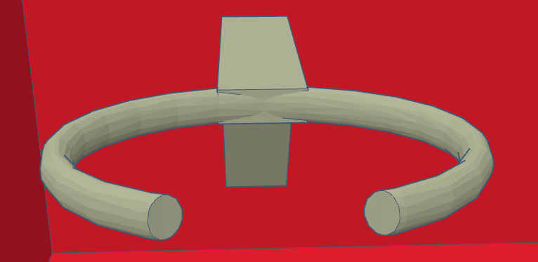 |

---

## 8. Coffee Liquid Reservoir (Inspired Design)
The coffee liquid reservoir was inspired by an existing model published on MakerWorld:
[https://makerworld.com/en/models/155504-keychain-container-pill-storage-bottle#profileId-836561](https://makerworld.com/en/models/155504-keychain-container-pill-storage-bottle#profileId-836561)

### Changes from the Original Model
- **Vertical Scaling:** The primary modification was increasing the height to expand fluid capacity.
- **Diameter Adjustment:** Both the top and bottom parts were adjusted to a diameter of **61 mm** to fit the machine's internal supports.
- The cap design and threading mechanism remain identical to the original author’s model.

### Notes
This design choice was made to increase usable volume while preserving the proven geometry of the original container (including its lid fit and mechanical structure).

### Images
| Top Part (Isometric) | Top Part (Top View) |
| :---: | :---: |
| 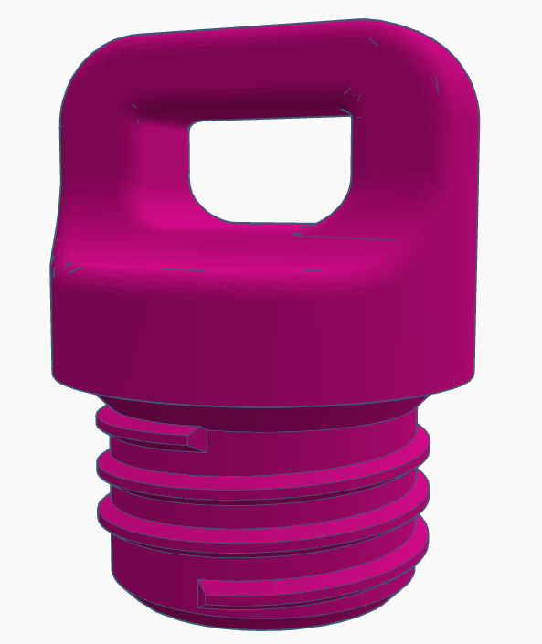 | 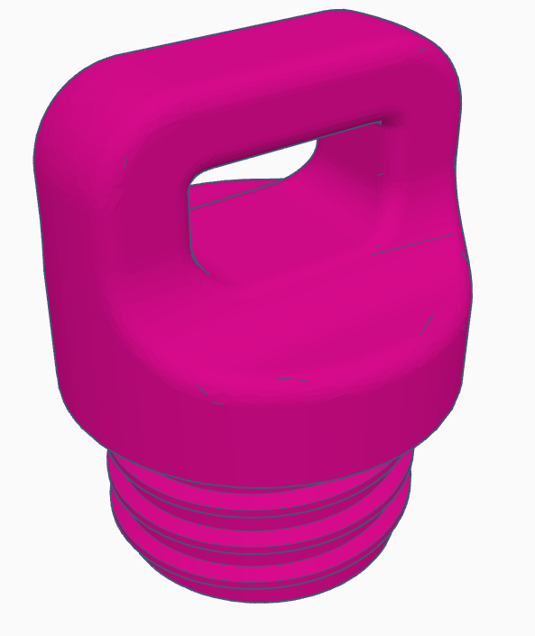 |

| Bottom Part (Isometric) | Bottom Part (Top View) |
| :---: | :---: |
| 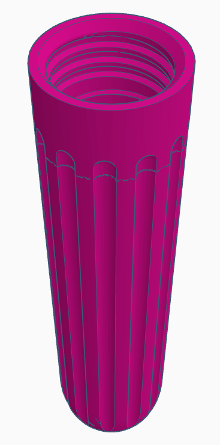 | 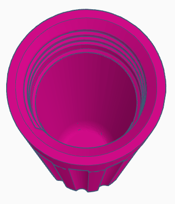 |

---

## 9. Downloads (STL Files)
All the STL files necessary for 3D printing these components are available in the repository. You can find them in the following directory:

📂 **[3D Models Folder](../../src/stl/)**
