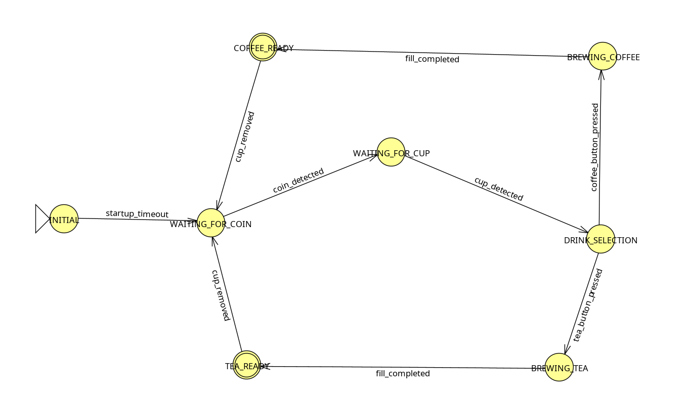

# ⚙️ Finite State Machine (FSM) Analysis

**Project:** Automated Hot Beverage Machine
**Module:** Firmware Logic (ESP32)

## 1. Overview

The system control logic is implemented using a **Finite State Machine (FSM)**. This approach ensures that the machine is always in a known, deterministic state, preventing invalid operations (e.g., pouring coffee without a cup or dispensing two drinks for one coin).

The FSM manages the entire lifecycle of a transaction: from initialization and coin detection to beverage dispensing and system reset.

***

## 2. State Diagram Representation

The following diagram represents the logical flow implemented in the firmware:

***

## 3. Detailed State Definitions

The system consists of **7 distinct states**. Each state defines specific active sensors and permitted actions.

| State Name | Description | Active Hardware / Output |
| :--- | :--- | :--- |
| **INITIAL** | System boot, variable initialization, and sensor calibration. | Display: "Initializing..." |
| **WAITING_FOR_COIN** | The machine is idle, waiting for a user to insert a coin (token). | Sensor: Ultrasonic 1 (Coin)   Display: "Insert Coin" |
| **WAITING_FOR_CUP** | A coin was validated. System now waits for a cup to be placed in the dispenser area. | Sensor: Ultrasonic 2 (Cup)   Display: "Place Cup" |
| **DRINK_SELECTION** | Cup is present. The system unlocks the touchscreen for beverage choice. | Input: Nextion Touch (UART)   Display: "Select Drink" |
| **BREWING_COFFEE** | The pump for Coffee is active for a calibrated duration. | Actuator: Pump 1 (ON)   Display: "Brewing Coffee..." |
| **BREWING_TEA** | The pump for Tea is active for a calibrated duration. | Actuator: Pump 2 (ON)   Display: "Brewing Tea..." |
| **COFFEE/TEA_READY** | Dispensing is done. System waits for the user to take their drink before resetting. | Sensor: Ultrasonic 2 (Cup)   Display: "Enjoy!" |

***

## 4. Transition Logic Table

Transitions are triggered by specific **events** (sensor readings, timers, or user inputs).

| Current State | Event / Condition | Next State | Justification |
| :--- | :--- | :--- | :--- |
| `INITIAL` | `startup_timeout` (e.g., 3s) | `WAITING_FOR_COIN` | Allows sensors to stabilize before reading. |
| `WAITING_FOR_COIN` | `coin_detected` (Distance < Threshold) | `WAITING_FOR_COIN` | Payment validated. Proceed to preparation. |
| `WAITING_FOR_CUP` | `cup_detected` (Distance < Threshold) | `DRINK_SELECTION` | Safety check: Ensures a container is present. |
| `DRINK_SELECTION` | `coffee_button_pressed` (UART 'A') | `BREWING_COFFEE` | User choice: Coffee. |
| `DRINK_SELECTION` | `tea_button_pressed` (UART 'B') | `BREWING_TEA` | User choice: Tea. |
| `BREWING_COFFEE` | `fill_completed` (Timer) | `COFFEE_READY` | Volumetric control by time (e.g., 5000ms). |
| `BREWING_TEA` | `fill_completed` (Timer) | `TEA_READY` | Volumetric control by time. |
| `COFFEE/TEA_READY` | `cup_removed` (Distance > Threshold) | `WAITING_FOR_COIN` | Reset cycle for next customer. |

***

## 5. Safety & Reliability Features

The FSM implementation provides critical safety mechanisms:

1.  **Interlock Safety:** It is impossible to activate a pump (Dispensing state) directly from the Idle state. The path *must* include Coin Validation → Cup Verification.
2.  **Spill Prevention:** The `WAITING_FOR_CUP` state acts as a physical barrier. If a user inserts a coin but forgets the cup, the machine waits indefinitely and does not dispense liquid into the tray.
3.  **Debouncing:** Sensor transitions (like `coin_detected`) typically implement software debouncing to prevent false positives from sensor noise.
4.  **Sequential Reset:** The machine only returns to `WAITING_FOR_COIN` after the previous user has removed their finished drink (`cup_removed`), preventing the next user from accidentally interacting with a finished cycle.